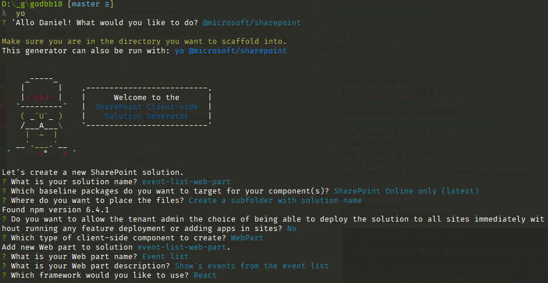
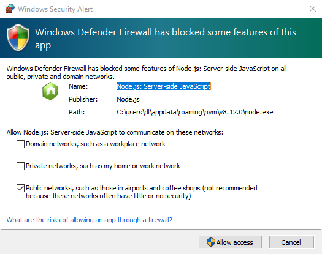
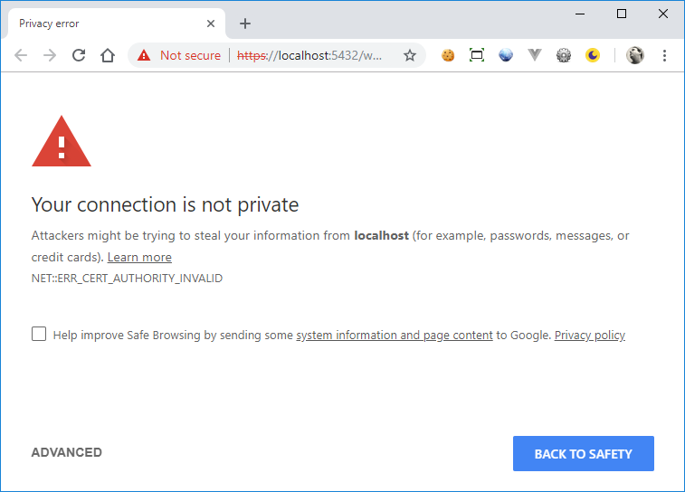
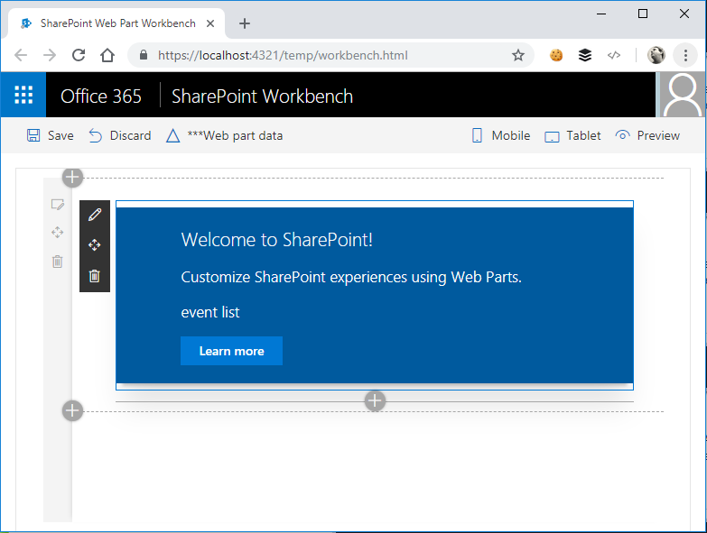
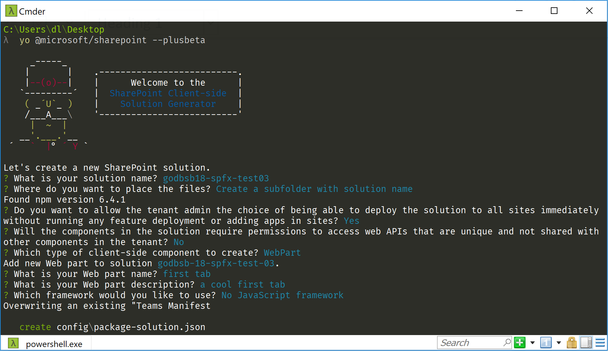

# Notizen
(Notes are in german language)

## Einleitung
Einen WebPart zum anzeigen von Events erstellen

## Setup Dev Tenant
Hat jemand noch keinen Developer Tenant?
https://docs.microsoft.com/en-us/sharepoint/dev/spfx/set-up-your-developer-tenant

## Setup environment
- Hat jemand die Entwicklungs-Tools noch nicht installiert?
- Download node lts
  - Latest ist nicht kompatibel mit SPFx, 
	https://nodejs.org/en/
  - Recommended nvm for windows, 
	https://github.com/coreybutler/nvm-windows, `nvm install 8.12.0`
- Install yeoman und gulp, `npm install -g yo gulp`
- Install yeoman generator, `npm install -g @microsoft/generator-sharepoint`

## Projekt erstellen
- Projekt erstellen, `yo @microsoft/sharepoint`



## Erster Build
Das Projekt kann direkt gebaut werden. Wir werden aufgeforder `gulp serve` auszuführen, also machen wir das auch.

- Konsole öffnen
- `gulp serve` ausführen





- Zertifikat installieren
- `gulp trust-dev-cert` ausführen

- Nach dem nächsten `gulp serve` läuft das Projekt 😊



- Yay! Es läuft! WebPart wird in der lokalen Workbench angezeigt. Edit zeigen und Description ändern.

## Projekt öffnen
- Node spezifische Ordner und Dateien
  - node_modules
  - package.json
  - Konfigurationsdateien wie tsconfig.json für die Typescript Kompilierung
- Config-Ordner enthält alle
  - Config.json enthält alle Informationen zu Projektbestandteilen wie WebParts
  - Package-solution.json enthält Informationen zum erstellen eines Deployment-Packages
- src-Folder
  - WebPart Dateien erklären
    - In WebPart TS die WebPart Properties zeigen und welche es noch gibt
- Es kommen neue Ordner dazu beim bauen des Projekts
  - Task Runner ist gulp
    - `gulp --tasks`

## WebPart ändern
- Zeigen, welche properties ein WebPart hat
  - **Wichtig**
    - this.properties
    - ❗ this.context
      - Am besten this.context.pageContext.web.absoluteUrl zeigen
- tsx mit Dummy-Inhalt rendern

## Local entwickeln
- Mocking der Daten und Interfaces
  - /interfaces/IEventItem.ts
  - /interfaces/IEventService.ts
  - /interfaces/IEventServiceOptions.ts
  - /services/MockEventsService.ts
- Implementieren
  - MockEventsService.ts
    - `godbb18-mockitems` Snippet
- Service Instanz in WebPart erstellen
- Daten ziehen und in WebPart darstellen
  - IEventListProps erweitern um items
  - Service get call
  - tsx erweitern um dynamischen Inhalt (`godbb18-items` snippet)
- Debuggen
  - Wichtig! Disable Cache!!!
- ❗ Logging zeigen
- Yay! Der WebPart läuft lokal

## Pause ?

## Anbinden an SharePoint
- Teamsite erstellen
- SharePoint Workbench öffnen
  - WebPart läuft mit Dummy Daten
- Liste anlegen
  - Startdate
  - Enddate
- Items in Liste anlegen

## Content von SharePoint laden
- Neuer Service SPEventsService.ts
  - Context an Service übergeben
- Service Instanz im WebPart anpassen
- ⭐ Rest-Query an SharePoint um Items zu ziehen
  - spHttpClient zeigen
  - Zeigen {url}/_api/web
  - https://bit.ly/sprest
  - ⭐ Abfrage bauen lassen
  - Query `${this.context.pageContext.web.absoluteUrl}/_api/web/lists/getbytitle('${this.options.listname}')/items...`
- Items per properties an Eventlist.tsx übergeben
- Dynamisieren
  - WebPart properties erweitern um list name
  - Webpart properties an service übergeben
  - Query anpassen mit list name
- Zeigen, dass bei jeder Property Änderung der Query ausgeführt wird, was blöd ist. Das kann man anpassen im WebPart
- Snippet `godbb18-saveproperties`
- Request optimieren
  - Select, order, filter einbauen (Snippet `godbb18-spreqparams`)
- Yay! Der Webpart läuft

## Deployment
- Bundle und package
- sppkg-Datei zeigen und erklären
- App Bereistellen in Apps Store
  - Hinweise beachten
  - Schauen, dass keine Errors da sind
- App auf Seite bereitstellen
- App updaten und neu bereitstellen (JS updatet sich immer)
- App Version aktualisieren mit neuem WebPart (neues "Feature")
- Yay! Der WebPart kann auf jeder Seite bereitgestellt werden.

## Microsoft Graph anbinden
- Einen neues Event im eigenen Kalender erstellen
  - https://developer.microsoft.com/en-us/graph/docs/api-reference/v1.0/api/calendar_post_events
- Services erweitern um addEventToCalendar(item: IEventItem) erweitern
    - Mock rejected einfach
- Service per props an tsx übergeben
- Join-Link in tsx einbauen
```html
<a href={'/add/' + item.ID} onClick={ (e) => { e.preventDefault(); this.addToCalendar(item.ID); } }>join</a>
```
```ts
addToCalendar(itemId: number) {
  const item = find(this.props.items, { ID: itemId };
  this.props.eventsService.addEventToCalendar(item);
  // ...
}
```
- Call in Service mit godbb18-graph-newevent snippet
- Solution um Berechtigung für Graph erweitern
  - webApiPermissionRequests zu package-solution hinzufügen
  - Snippet `godbb18-graph`
- Zu Deployment springen wegen Berechtigungen erteilen

## Deployment Graph berechtigen
- Solution bundlen und packagen
- Hochladen und auf Berechtigungen hinweißen
- Berechtigungen im Admin-Center erteilen
- Zeigen, dass der Request funktioniert
- Yay! Wir haben eine Graph Anbindung!

## CDN aktivieren
- SharePoint Management Shell installieren, https://www.microsoft.com/en-US/download/details.aspx?id=35588
- `Connect-SPOService https://{tenant}-admin.sharepoint.com`
- `Get-SPOTenantCdnEnabled -CdnType Public`
- `Set-SPOTenantCdnEnabled -CdnType Public`
- Weitere Infos, 
https://developer.microsoft.com/en-us/office/blogs/general-availability-of-office-365-cdn/

## Special: SPFx WebParts in Teams
- Wichtig: Version 1.7 von SPFx muss installiert sein
- Projekt erstellen
```
yo @microsoft/sharepoint --plusbeta
```



- Code anpassen (Snippet `godbb18-teamsctx` und `godbb18-teamstitle`)
- In Admin-Center unter Settings _Allow sideloading of external apps_ ermöglichen


- App hochladen
- Team Ordner zippen
- Auf https://teams.microsoft.com wechseln
- Zip in Channel hochladen
- Als Tab hinzufügen

## Special: Erweiterung Build-Task - WebPack Bundle Analyzer
- `npm i webpack-bundle-analyzer --save-dev`
- Gulpfile öffnen und `godbb18-webpack-bundle-analyzer` Snippet auswählen
- Build ausführen
- Bundle Analyzer Output zeigen

