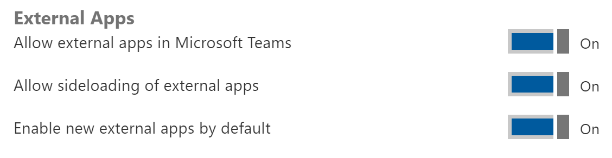
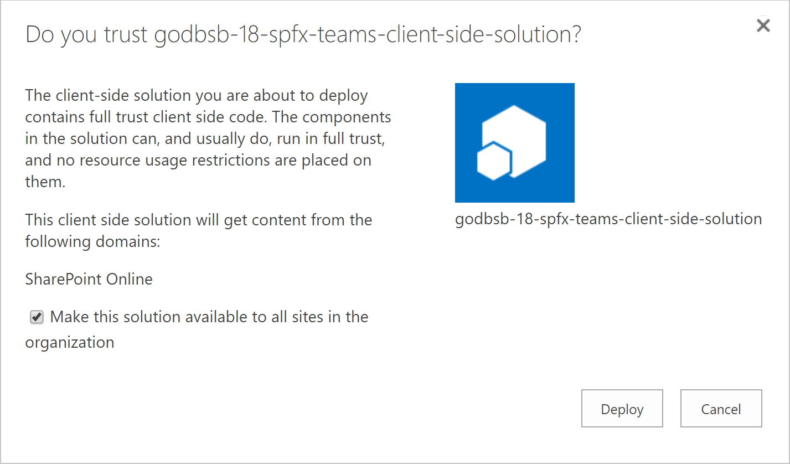
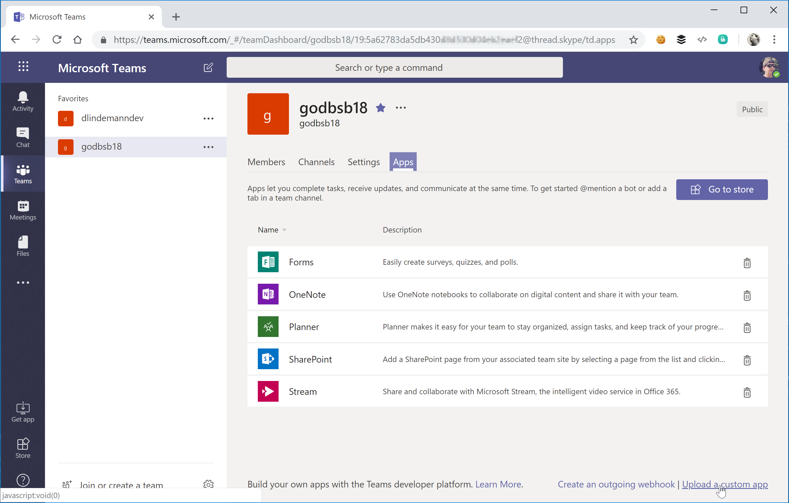
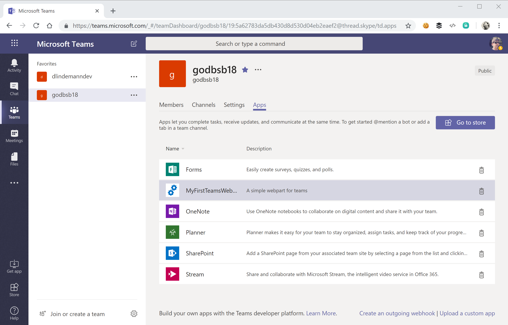
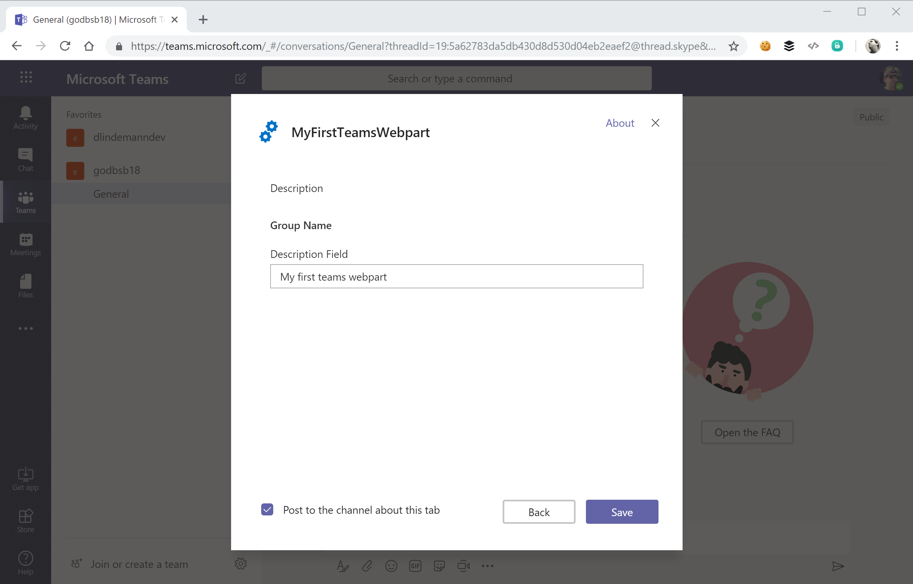
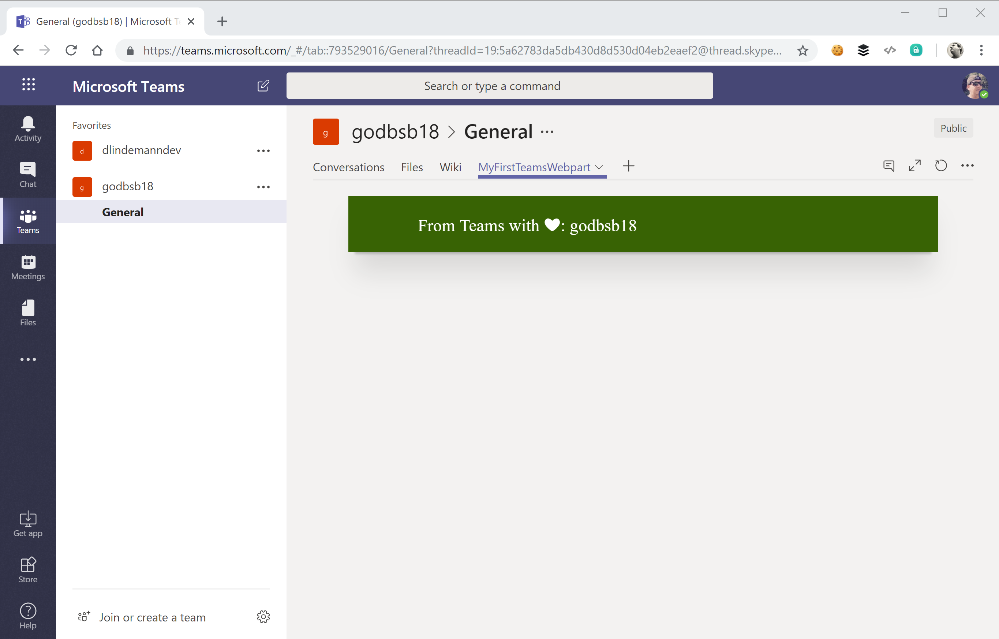

# Global Office 365 Developer Bootcamp (2018)
### SharePoint Framework WebParts in Microsoft Teams

## Setup an Office 365 Developer Tenant and Dev environment
If you are a developer, you can register for an Office 365 Developer tenant. There you can test the WebPart.

More information: https://docs.microsoft.com/en-us/sharepoint/dev/spfx/set-up-your-developer-tenant

Ensure you installed NodeJS and the required global packages.

More information: https://docs.microsoft.com/en-us/sharepoint/dev/spfx/set-up-your-development-environment

## Build the project
- Ensure NodeJS is installed; SPFx 1.7 requires NodeJS 8.9.4 or higher
- Ensure you have installed the global packages `gulp`, `yo` and `@microsoft/generator-sharepoint`
- Open the project folder within a console (VS Code Terminal, PowerShell, etc.) and run `npm i`
- Build a sppkg-File by running the commands `gulp bundle --ship` and `gulp package-solution --ship`

## Configure teams to allow apps
- Go to the Office 365 admin portal (https://admin.microsoft.com/)
- In the menu click `Services` and `Services & Add-ins`
- Choose `Microsoft Teams`
- Open the `apps` tab
- Toggle `Allow sideloading of external apps`
- Hit save

## Deploy the project
- Go to your SharePoint App Store. The URL for the App Store can look like this `https://{tenant-url}/sites/apps`
- Upload the file `./sharepoint/solution/godbsb-18-spfx-teams.sppkg` to the `Apps for SharePoint` library
- Ensure you checked the box `Make this solution available to all sites in the organization`
- Add the solution by clicking `Deploy`

## Zip Teams solution
- Open the `teams` folder in the solution
- Mark all files and zip them (via right click, send to, compressed (zipped) folder)
- Give the file a name, e.g. `MyFirstTab.zip`

## Publish WebPart in Teams Channel
- Open Microsoft Teams in the browser by entering `https://teams.microsoft.com`
- Go to the team you want to add the WebPart
- Click `Manage team` from more actions menu
- Go to the `Apps` tab and click `Upload a custom app`

- Choose the zip file and upload
- The Teams solutions was added

- Go to the channel and click the `add a tab` icon
- Choose the `MyFirstTeamsWebPart`
- Configure the WebPart tab

- hit `save`
- The WebPart is running on teams! Have fun!

